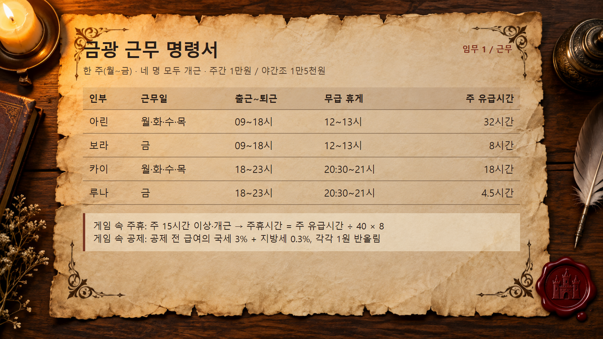
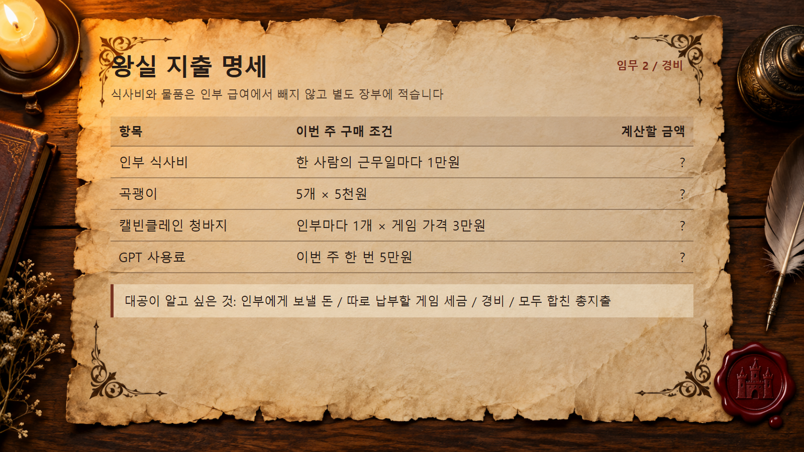
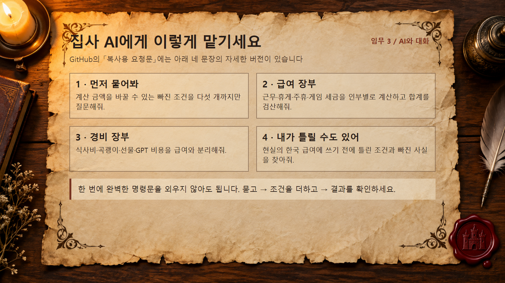
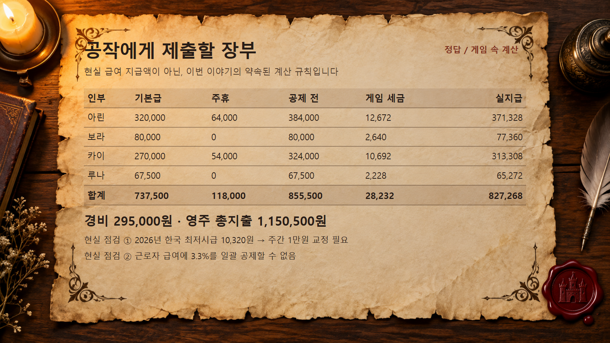

# 북부대공의 금광 급여 장부

소설 속 금광 인부 네 명의 **한 주 급여와 경비**를 AI와 함께 정리하는 20분 실습입니다. ChatGPT나 Claude의 채팅창을 사용할 수 있으면 됩니다. GitHub 로그인, Git 설치, API 키는 필요하지 않습니다.

수업에서는 [2분 10초 도입 영상](video/북부성_실습_인트로.mp4)을 먼저 보고 임무를 시작합니다. 정산을 마치면 [5초 엔딩](video/북부성_실습_5초_엔딩.mp4)을 재생하세요. 영상이 열리지 않아도 아래 상황 카드만으로 실습할 수 있습니다.

수업 화면이나 인쇄물에는 아래 QR을 넣으면 이 페이지로 바로 들어올 수 있습니다.

## 시작하기

1. [상황 카드](01_상황_카드.md)를 엽니다.
2. [복사용 요청문](02_복사용_요청문.md)의 1번부터 차례로 AI에 보냅니다.
3. AI의 숫자를 [정답과 현실 점검](03_정답과_현실_점검.md)과 비교합니다.
4. 내 실제 업무에서 AI에게 먼저 알려줘야 할 조건을 한 문장으로 적습니다.

영상 도입부가 끝난 시점부터 실습을 시작합니다. 마치면 공작과의 데이트 및 현실 귀환 엔딩이 이어집니다.

강사는 [20분 진행안](20분%20실습%20시나리오%20-%202026-09-27%20GPT.md)을 참고할 수 있습니다.

## 오늘 남길 결과

- 인부별 유급 근로시간·기본급·주휴·게임 속 공제·실지급 표
- 급여와 분리한 경비표 및 총지출
- 현실에 바로 적용하면 안 되는 조건 두 가지

AI가 다르게 계산하면 먼저 **근무 중 휴게시간, 주휴 대상, 세금 반올림**을 다시 확인해 보세요. 답을 다시 요청하는 것도 실습입니다.

같은 자료를 중세풍 종이 카드로도 볼 수 있습니다. 화면에서 글씨가 작으면 위 문서의 표와 문장을 사용하세요.

| 근무 명령서 | 경비 명세 |
|---|---|
|  |  |
| AI 요청문 | 정답 장부 |
|  |  |

## 수업 뒤에 더 해보고 싶다면

[확장 과제](04_확장_과제.md)는 같은 장부를 2주치와 스프레드시트로 늘리는 방법입니다. 첫날의 필수 과제는 아닙니다.

이 자료는 가상 이야기입니다. 현실 급여 지급·세금 신고의 기준으로 사용하지 마세요.
